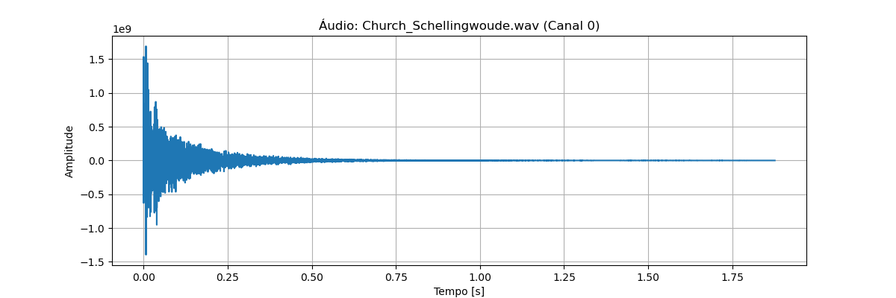

## 1. Introdução

Neste projeto, o objetivo é implementar a Convolução da Soma para processar um sinal de voz usando como referência a resposta ao impulso da igreja de Schellingwoude, registrada no arquivo 'Church_Schellingwoude.wav'.

O arquivo contém a resposta acústica do ambiente, mostrando como um impulso curto se propaga e reverbera. Visualizando o áudio, nota-se um pico inicial seguido de decaimento, característico de respostas ao impulso.



---

## 2. Fundamentação Teórica

A acústica de um ambiente pode ser modelada como um **Sistema Linear Invariante no Tempo (SLIT).**

### 2.1. Propriedades de um SLIT

Um sistema discreto $T$ é chamado de linear e invariante no tempo se satisfaz duas propriedades fundamentais:

- **Linearidade:** Para quaisquer sinais de entrada $x_1[n]$ e $x_2[n]$ e quaisquer escalares $a$ e $b$, o sistema obedece ao princípio da superposição:
```math
T\{ a x_1[n] + b x_2[n] \} = a \, T\{x_1[n]\} + b \, T\{x_2[n]\}
```

- **Invariância no tempo:** O comportamento do sistema não muda com o tempo. Um atraso na entrada produz o mesmo atraso na saída.
Se $x[n-n_0]$ é a entrada atrasada em $n_0$ amostras, a saída será:
```math
T\{ x[n-n_0] \} = y[n-n_0]
``` 

### 2.2. A Resposta ao Impulso $(h[n])$

É definida como a saída do sistema, $h[n]$, quando a entrada é um impulso unitário, $\delta[n]$. Conhecê-la nos permite determinar a saída para qualquer sinal de entrada.

### 2.3. Dedução da convolução
A convolução surge da aplicação das propriedades de um SLIT sobre um sinal de entrada genérico.

Sinais de tempo discreto podem ser escritos como uma soma ponderada de impulsos unitários $\delta[n-k]$:
```math
x[n] = \sum_{k=-\infty}^{\infty} x[k] \, \delta[n-k]
```

A saída $y[n]$ é $T{x[n]}$. Usando a propriedade de **linearidade**, movemos o operador $T$ para dentro da soma:

```math
T\{ x[n] \} = T\left\{ \sum_{k=-\infty}^{\infty} x[k] \, \delta[n-k] \right\} 
= \sum_{k=-\infty}^{\infty} x[k] \, T\{ \delta[n-k] \}
```

Agora aplicando **invariância no tempo**: a resposta do sistema a $\delta[n-k]$ é apenas a resposta ao impulso deslocada:
```math
T\{ \delta[n-k] \} = h[n-k]
```

Portanto, a saída $y[n]$ do sistema é a **convolução** da entrada $x[n]$ com a resposta ao impulso $h[n]$:
```math
y[n] = x[n] * h[n] = \sum_{k=-\infty}^{\infty} x[k] \, h[n-k]
```

> Nesse projeto, $x[n]$ é a **voz gravada** e $h[n]$ é a **resposta ao impulso da igreja**. A operação de convolução simula como a voz seria alterada pelo ambiente.

## 3. Passo a passo do projeto

1. **Leitura do arquivo de resposta ao impulso**  
   - Carregar o áudio `'Church_Schellingwoude.wav'`;
   - Como o arquivo é estéreo (2 canais), apenas o primeiro canal (mono) foi utilizado para simplificar a análise e focar no processamento de um único sinal.

2. **Gravação de uma amostra de voz**  
   - Capturar a voz do usuário;  
   - A voz gravada é armazenada em um vetor.

3. **Convolução**  
   - Convolução entre o vetor da voz e a resposta ao impulso;  
   - O resultado simula a voz no ambiente da igreja, considerando reflexões e reverberações.

4. **Normalização e salvamento**  
   - Normalizar o sinal resultante para evitar clipping;
   - Salvar o áudio final.


